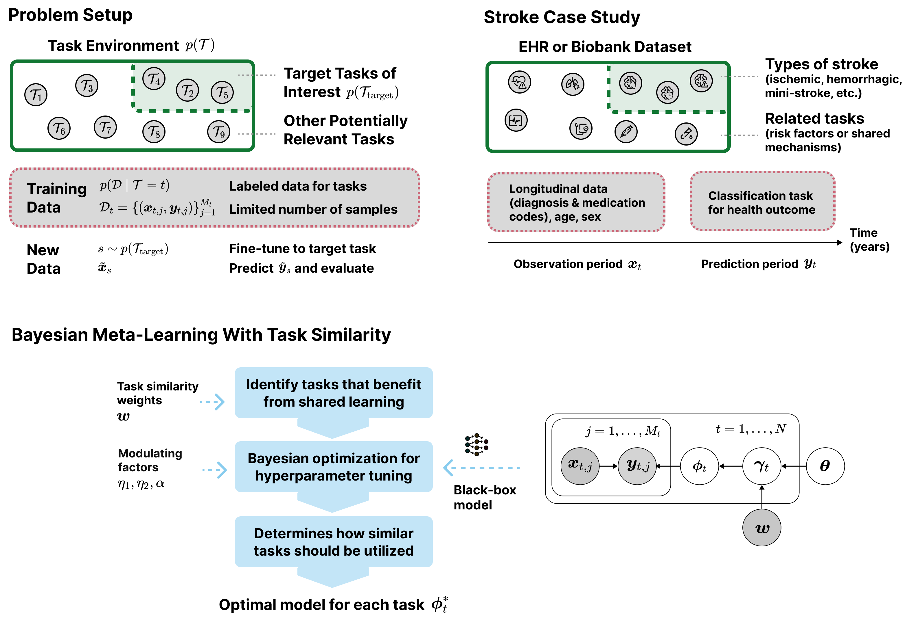

# Bayesian Meta-Learning for Improving Generalizability of Health Prediction Models With Similar Causal Mechanisms

Code for the paper [Bayesian Meta-Learning for Improving Generalizability of Health Prediction Models With Similar Causal Mechanisms](https://arxiv.org/abs/2310.12595)

## Abstract



Machine learning strategies like multi-task learning, meta-learning, and transfer learning enable efficient adaptation of machine learning models to specific applications in healthcare, such as prediction of various diseases, by leveraging generalizable knowledge across large datasets and multiple domains. In particular, Bayesian meta-learning methods pool data across related prediction tasks to learn prior distributions for model parameters, which are then used to derive models for specific tasks. However, inter- and intra-task variability due to disease heterogeneity and other patient-level differences pose challenges of negative transfer during shared learning and poor generalizability to new patients. We introduce a novel Bayesian meta-learning approach that aims to address this in two key settings: (1) predictions for new patients (same population as the training set) and (2) adapting to new patient populations. Our main contribution is in modeling similarity between causal mechanisms of the tasks, for (1) mitigating negative transfer during training and (2) fine-tuning that pools information from tasks that are expected to aid generalizability. We propose an algorithm for implementing this approach for Bayesian deep learning, and apply it to a case study for stroke prediction tasks using electronic health record data. Experiments for the UK Biobank dataset as the training population demonstrated significant generalizability improvements compared to standard meta-learning, non-causal task similarity measures, and local baselines (separate models for each task). This was assessed for a variety of tasks that considered both new patients from the training population (UK Biobank) and a new population (FinnGen).

### Citation (preprint)
```
@misc{wharrie2024bayesmetalearning,
      title={Bayesian Meta-Learning for Improving Generalizability of Health Prediction Models With Similar Causal Mechanisms}, 
      author={Sophie Wharrie and Lisa Eick and Lotta Mäkinen and Andrea Ganna and Samuel Kaski},
      year={2024},
      eprint={2310.12595},
      archivePrefix={arXiv},
      primaryClass={cs.LG},
      url={https://arxiv.org/abs/2310.12595}, 
}
```

## Python setup

The Python dependencies are listed in `requirements.txt`. For example, to set this up in a virtual environment:

1. Create a virtual environment

```
python3 -m venv experiment_env
```

2. Activate the virtual environment

```
source experiment_env/bin/activate
```

3. Install the Python dependencies

```
pip install -r requirements.txt
```

### Weights & Biases

The code uses [Weights & Biases](https://wandb.ai/site) for experiment tracking and hyperparameter tuning, which requires an account and API key. See the tutorial section below on options for running the code without Weights & Biases.

## Usage

### Data inputs

**An example (toy dataset) is provided in the `data/example` directory.**

There are 4 files required as inputs (CSV-formatted):
- **Main (tabular) data file (mainfile)**: contains data for the binary classification tasks (patient identifiers, labels for supervised learning, tabular machine learning features, patient cohort definitions)
- **Longitudinal data file (longfile)**: contains additional longitudinal (time series) machine learning features (in sparse format)
- **Metadata file (metafile)**: contains metadata describing the columns in the mainfile
- **Task distance file (distfile)**: contains distances between pairs of tasks, used to derive (causal) task similarity weights
    - **Important note: to reproduce the methods used in the paper experiments, see the code and instructions in the `causal_distances` directory of this repository**

See below for details on preparing all four files:

#### Mainfile

This contains the main data for all `n` binary classification tasks (patient IDs, `k` tabular ML features, labels, cohorts):

- `id` (int or string): a patient identifier column
- `X1, X2, ..., Xk` (any numerical data type): (tabular) predictors for all tasks
- `Y1, Y2, ...., Yn` (binary): labels to predict for each task
    - The `n` tasks include both training and target tasks (note: it's possible to include the same task as both a training *and* target task)
- `C1, C2, ..., Cn` (binary): cohorts for each task (a row with `Ci=1` means the patient in that row is used by task `i`, and `Ci=0` means they are excluded from that task)

| id | X1 | X2 | ... | Xk | Y1 | Y2 | ... | Yn | C1 | C2 | ... | Cn |
|---|---|---|---|---|---|---|---|---|---|---|---|---|
|xxx|xxx|xxx|xxx|xxx|xxx|xxx|xxx|xxx|xxx|xxx|xxx|xxx|
|...|...|...|...|...|...|...|...|...|...|...|...|...|
|xxx|xxx|xxx|xxx|xxx|xxx|xxx|xxx|xxx|xxx|xxx|xxx|xxx|

Additional notes:
- You can use any column names in the mainfile. The mapping of column names to their column type will need to be specified in the metafile (see below). 
- All tasks should have a corresponding `cohort` column. Cohorts can be used to define the patient cohort for each task (e.g, if you want to exclude some patients from the analysis of some tasks)

#### Longfile

The neural network implemented in the code uses an LSTM architecture and also expects a separate file for longitudinal (time series) machine learning features in sparse format:

- `PATIENT_ID` (int or string): a patient identifier column (same as in mainfile)
- `EVENT_YEAR` (int): year of the medical event 
- `ENDPOINT` (string): the name of the medical event (e.g., ICD-10 code or other identifier)

| PATIENT_ID | EVENT_YEAR | ENDPOINT |
|---|---|---|
|patient_x|2000|X4|
|patient_x|2001|V6|
|patient_x|1990|W4|
|patient_x|1995|W4|
|patient_y|2010|X5|
|patient_y|2003|V9|
|...|...|...|

Additional notes:
- The column headers *must* have the names `PATIENT_ID`, `EVENT_YEAR` and `ENDPOINT`
- If using the scripts in this repository for preparing the distfile, `ENDPOINT`s should include *at least* all the tasks (both training and target tasks) from the mainfile as endpoints (using the column names as endpoint names), and can also include additional endpoints

#### Metafile

This file provides a list of `column_name`'s (in the same order they appear in the mainfile), and describes their `column_type`'s as either `patient_id`, `predictor`, `task_label`, `target_task`, or `cohort`:

- `column_name`: the name of the column (same as it appears in the mainfile)
- `column_type`: the type of column (`patient_id`, `predictor`, `task_label`, `target_task`, or `cohort`). The tasks `Y1, Y2, ..., Yn` have type `task_label` (training tasks) or `target_task` (target task)
- `task_cohort`: the name of the task corresponding to the cohort (blank for the non-cohort columns)

| column_name | column_type | task_cohort |
|---|---|---|
| id | patient_id | |
| X1 | predictor | |
| X2 | predictor | |
|...|...|...|
| Xk | predictor | |
| Y1 | task_label | |
| Y2 | task_label | |
|...|...|...|
| Yn | task_label | |
| C1 | cohort | Y1 |
| C2 | cohort | Y2 |
|...|...|...|
| Cn | cohort | Yn |

Additional notes:
- The rows in the metafile need to be ordered in the same order they appear as columns in the mainfile

#### Distfile

This is a table of distances between *all* pairs of tasks (including both training and target tasks); used to derive (causal) task similarity weights:

- `task1` and `task2`: the names of the tasks in the pair
- `value`: the distance value for the pair `(task1, task2)`, where lower values indicate more similar tasks

| task1 | task2 | value |
|---|---|---|
| Y0 | Y0 | 0 | 
| Y0 | Y1 | 0.4 | 
| Y0 | Y2 | 0.3 | 
|...|...|...|
| Yn | Yn | 0 | 

Additional notes:
- The values *do not* need to be normalised between 0 and 1
- Distances are *symmetric*, i.e., `d(task1, task2) = d(task2, task1)`
- The number of rows in the distfile should be `n*n`, where `n` is the total number of tasks
- The distance between the same task should be 0
- **Important note: to reproduce the methods used in the paper experiments, see the code and instructions in the `causal_distances` directory of this repository**

### Running the ML models

In general, the models are run using the following Python command, replacing the placeholders with values for your input arguments. See the `method/main.py` file for details of the input arguments. Also see the tutorial below for how to apply this command to the example dataset.

```
python3 ./method/main.py --tabular_datafile {tabular_datafile} --longitudinal_datafile {longitudinal_datafile} --metafile {metafile} --distancefile {distancefile} --outprefix {outprefix} --data_type {data_type} --learning_type {learning_type} --test_frac {test_frac} --query_frac {query_frac} --case_frac {case_frac} --batch_size {batch_size} --method {method} --random_seed {random_seed} --n_kfold_splits {n_kfold_splits} --minibatch_size {minibatch_size} --max_num_epochs {max_num_epochs} --num_mc_samples {num_mc_samples} --wandb_n_trials {wandb_n_trials} --wandb_eval {wandb_eval} --wandb_direction {wandb_direction} --wandb_key_file {wandb_key_file} --sweep_id_filename {sweep_id_filename} --wandb_project {wandb_project} --wandb_entity {wandb_entity} --mode {mode}
```

#### Tutorial for example dataset

There are two main ways of running the code - either using Weights & Biases for hyperparameter tuning or running the code without Weights & Biases and hyperparameter tuning (providing hard-coded hyperparameter values).

The below commands give examples for both settings, for all machine learning methods and baselines presented in the paper.

If using Weights & Biases, first add your API credentials to a text file (for example, `credentials/wandb_api_key.txt`) and give the filepath as a command argument below.

Make sure the Python environment is activated before running the code below.

**Without hyperparameter tuning:**

1. First you need to edit `method/main.py` to replace the placeholder dictionaries (`best_params`) with your values
1. Make sure the directory for the `outprefix` exists
1. Run one or multiple of the following commands for your chosen model/s (example values for options are given below, replace to suit your needs):

- Local baselines (separate models for each task): use `method bnn_baseline` and `mode debug`
```
python3 ./method/main.py --tabular_datafile data/example/example_tabular_data.csv --longitudinal_datafile data/example/example_longitudinal_data.csv --metafile data/example/example_col_metadata.csv --distancefile data/example/example_causal_dist.csv --outprefix results/test_bnn_baseline --data_type sequence --learning_type transductive --test_frac 0.5 --query_frac 0.5 --case_frac 0.5 --batch_size 200 --method bnn_baseline --random_seed 42 --n_kfold_splits 2 --minibatch_size 5 --max_num_epochs 5 --num_mc_samples 10 --mode debug
```
- Meta-learning baseline (without task similarity): use `method 2_level_hierarchical` and `mode debug`
```
python3 ./method/main.py --tabular_datafile data/example/example_tabular_data.csv --longitudinal_datafile data/example/example_longitudinal_data.csv --metafile data/example/example_col_metadata.csv --distancefile data/example/example_causal_dist.csv --outprefix results/test_metalearning_baseline --data_type sequence --learning_type transductive --test_frac 0.5 --query_frac 0.5 --case_frac 0.5 --batch_size 200 --method 2_level_hierarchical --random_seed 42 --n_kfold_splits 2 --minibatch_size 5 --max_num_epochs 5 --num_mc_samples 10 --mode debug
```
- Meta-learning with task similarity: use `method 3_level_hierarchical` and `mode debug`
```
python3 ./method/main.py --tabular_datafile data/example/example_tabular_data.csv --longitudinal_datafile data/example/example_longitudinal_data.csv --metafile data/example/example_col_metadata.csv --distancefile data/example/example_causal_dist.csv --outprefix results/test_metalearning_main --data_type sequence --learning_type transductive --test_frac 0.5 --query_frac 0.5 --case_frac 0.5 --batch_size 200 --method 3_level_hierarchical --random_seed 42 --n_kfold_splits 2 --minibatch_size 5 --max_num_epochs 5 --num_mc_samples 10 --mode debug
```

4. Review the command line output and `outprefix` location for the results

**With hyperparameter tuning:**

See the instructions in the `experiments` directory for how to reproduce the experiments from the paper that use Weights & Biases for hyperparameter tunimg. These are designed to be run efficiently on GPU.


## Acknowledgements

We acknowledge the following code packages and repositories that were especially useful for carrying out our research:
- [Posteriors](https://github.com/normal-computing/posteriors)
- [DiBS](https://github.com/larslorch/dibs)
- [TwoSampleMR (R package)](https://mrcieu.github.io/TwoSampleMR/articles/introduction.html)
- [InvariantCausalPrediction (R package)](https://cran.r-project.org/web/packages/InvariantCausalPrediction/index.html)